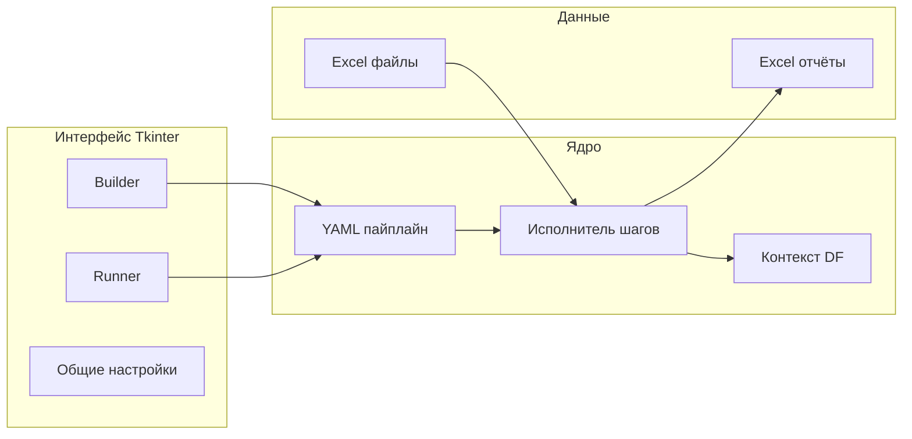

# ExcelForge — презентация

> Материал для демонстрации возможностей программы. Каждый блок `---` можно использовать как отдельный слайд.

---

## Слайд 1. Название

# ExcelForge

**Конструктор и исполнитель пайплайнов обработки Excel**

- Десктопное приложение на Python (Tkinter)
- Логика обработки — YAML-сценарии + pandas
- Без программирования для типовых задач отчётности

---

## Слайд 2. Проблема

### Что обычно делают вручную

- Собирают выгрузки из нескольких Excel-файлов
- Фильтруют, объединяют, подставляют справочники (ВПР)
- Группируют, считают итоги, формируют отчёт
- Повторяют одни и те же шаги каждый месяц / квартал

### Риски

- Ошибки в формулах и копировании
- Долгое время на рутину
- Сложно передать процесс коллеге

---

## Слайд 3. Решение

### ExcelForge автоматизирует цепочку

```
Excel (вход)  →  DataFrame (pandas)  →  шаги пайплайна  →  Excel (выход)
```

- Сценарий хранится в **YAML** — прозрачно и версионируемо
- Выполнение — по кнопке в **Runner**
- Создание и правка сценария — в **Builder**

---

## Слайд 4. Архитектура (логическая)



---

## Слайд 5. Интерфейс — три вкладки

| Вкладка | Назначение |
|---------|------------|
| **Runner (выполнение)** | Выбор готового YAML, запуск, протокол, прогресс |
| **Builder (конструктор)** | Создание/редактирование пайплайна, отладка шагов, просмотр DF |
| **Общие настройки** | Шрифт интерфейса, число строк предпросмотра, сохранение настроек |

---

## Слайд 6. Пайплайн — что это

**Пайплайн** — файл `.yaml` / `.yml` со списком **шагов**.

```yaml
pipeline_version: 1
name: Мой отчёт
description: Краткое описание
steps:
  - id: load_1
    type: load_excel
    params: { ... }
  - id: filter_1
    type: filtration
    params: { ... }
  - id: save_1
    type: save_excel
    params: { ... }
```

Каждый шаг читает и/или записывает **именованные DataFrame** в общем контексте.

---

## Слайд 7. Загрузка и выгрузка

### Вход

- Один файл, маска файлов в каталоге, «самый новый» файл
- Служебные столбцы `_from_file`, `_date_file`
- Диалоги выбора файла/папки при запуске из GUI

### Выход

- Простая запись, шаблон Excel, разбиение по значению колонки
- Режим **несколько DF → один файл** (каждый DF — свой лист)
- Дописывание в книгу (`writer_mode: a`, `if_sheet_exists`)

---

## Слайд 8. Обработка данных (основные шаги)

| Группа | Шаги |
|--------|------|
| Фильтрация | Фильтрация строк, Запросы (query), Удаление строк |
| Объединение | Merge, Склеить датафреймы |
| Преобразования | Операции с DF, Текст, Типы столбцов, Переименование |
| Аналитика | Группировка и агрегация, Сортировка и вывод по списку |
| Прочее | Транспонировать DataFrame, Общие настройки (глобальные переменные) |

Полный справочник параметров — в `app/docs/pipeline_steps.md` и в окне **«Документация шага»** в Builder.

---

## Слайд 9. Примеры применения

- **Справочники** — загрузка выгрузок, фильтрация, merge, выгрузка в шаблон
- **Контроль остатков** — несколько источников, query, группировка, отчёт
- **Сборка файлов** — mask-загрузка, concat, save с `mask_sheets`
- **Демо и обучение** — готовые YAML в папке `pipelines/`

---

## Слайд 10. Преимущества

- **Повторяемость** — один YAML на регулярный отчёт
- **Прозрачность** — шаги и параметры видны в текстовом виде
- **Отладка** — предпросмотр DF, выполнение до выбранного шага
- **Расширяемость** — новые типы шагов регистрируются в коде
- **Локальность** — данные не уходят в облако (всё на ПК пользователя)

---

## Слайд 11. Требования и стек

| Компонент | Версия / примечание |
|-----------|---------------------|
| ОС | Windows 10/11 (основная целевая), Python кроссплатформенный |
| Python | 3.10+ рекомендуется |
| pandas, openpyxl | Excel ↔ DataFrame |
| PyYAML | Пайплайны |
| markdown2 | Документация шагов в UI |
| Tkinter | Входит в стандартную поставку Python на Windows |

---

## Слайд 12. Следующие шаги

1. Установить зависимости (`requirements.txt`)
2. Запустить `python -m app.main`
3. Открыть пример из `pipelines/` в Runner
4. Адаптировать YAML под свои файлы в Builder

Подробности: `docs/02_РАЗВЕРТЫВАНИЕ.md`, `docs/03_РУКОВОДСТВО_ПОЛЬЗОВАТЕЛЯ.md`

---

## Контакты и сопровождение

- Исходный код и пайплайны — в каталоге проекта **ExcelForge**
- Справочник шагов для разработчиков сценариев: `app/docs/pipeline_steps.md`
